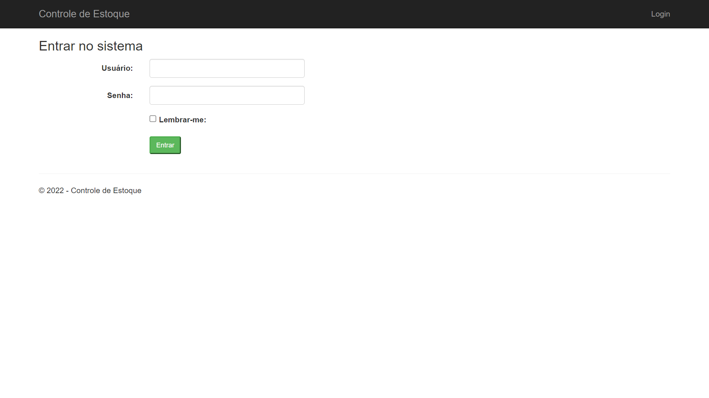
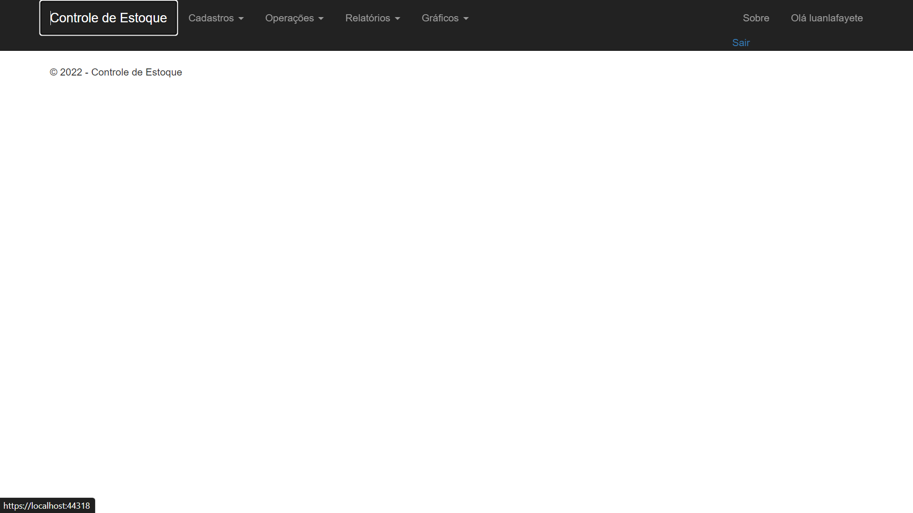

# Projeto Controle de estoque 

>Trilha Lexical Coder

Projeto construído do curso do Professor Reniere Silva

[🔗 Clique aqui para acessar](https://luanlafayete.github.io/ProjetoControleDeEstoque/)

## 💻 Tecnologias 
- HTML
- CSS
- Git e Github
- ASP.NET MVC
- C#
- SQL Server
- Xamarin
- Entity Framework

## ☎ Contato
- LinkedIn: 
https://www.linkedin.com/in/lu%C3%A3-lafayete-salgado-42467a42/
- Email: luanlafayete@gmail.com
